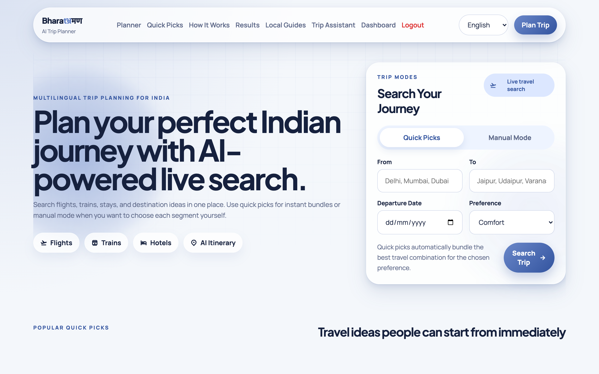
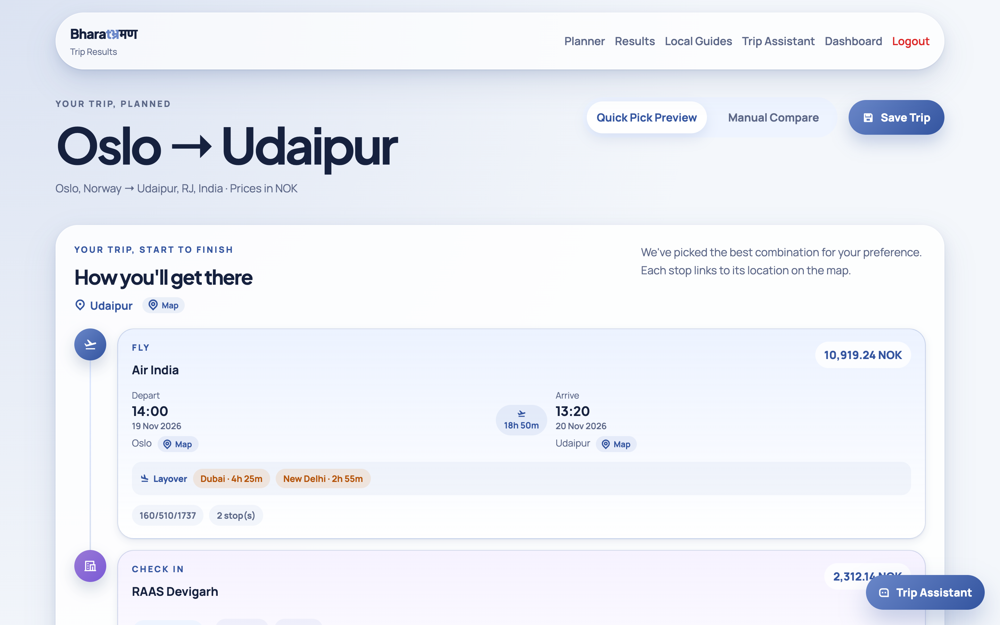
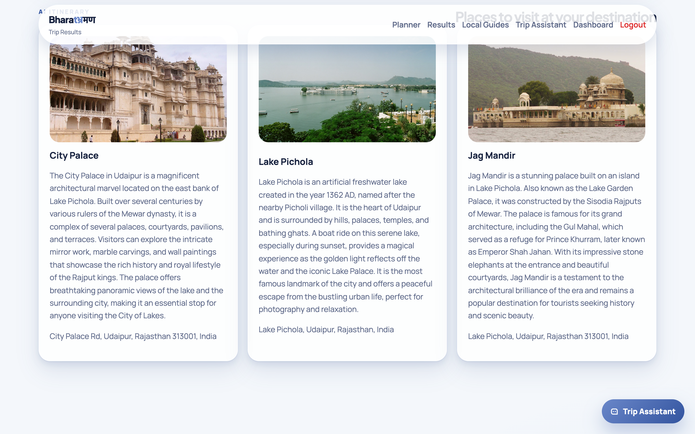
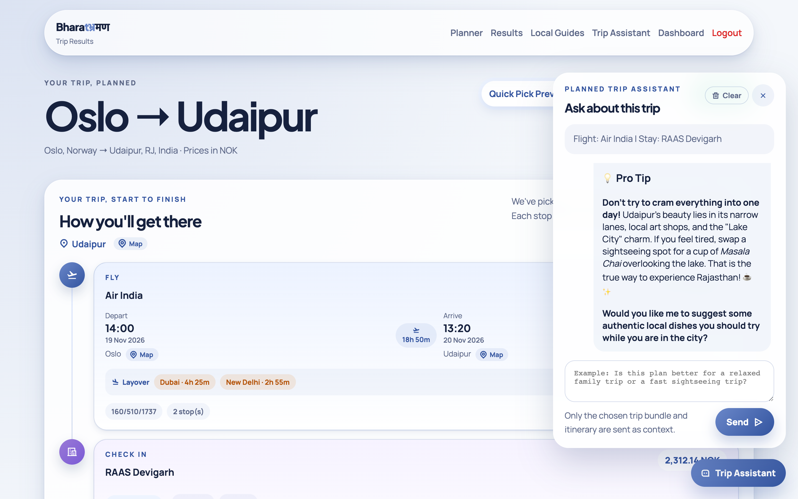
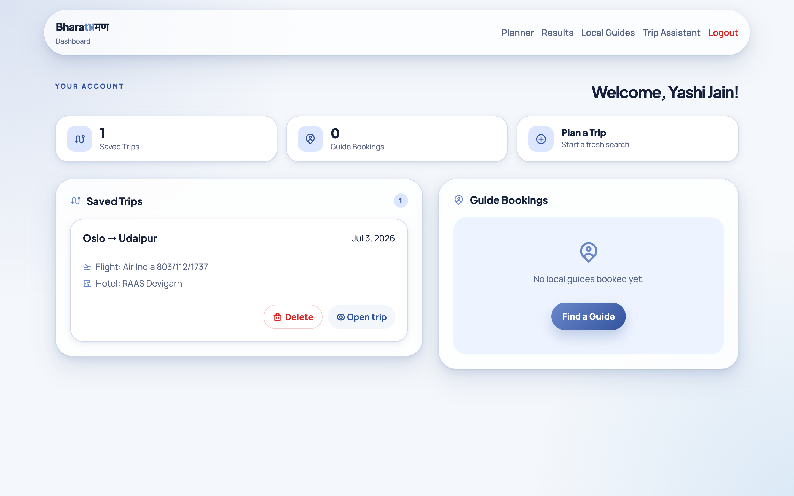
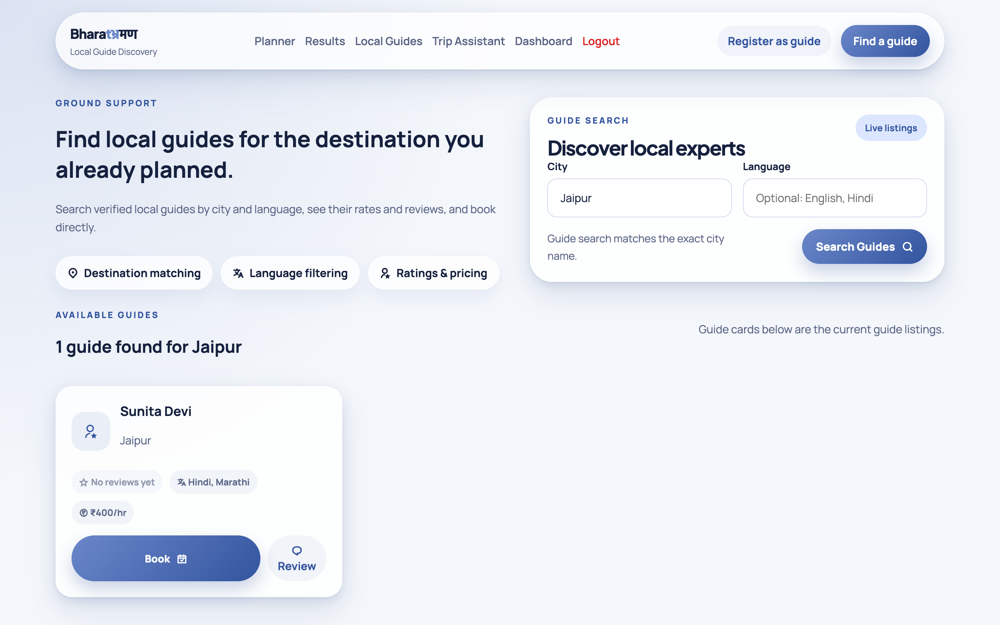
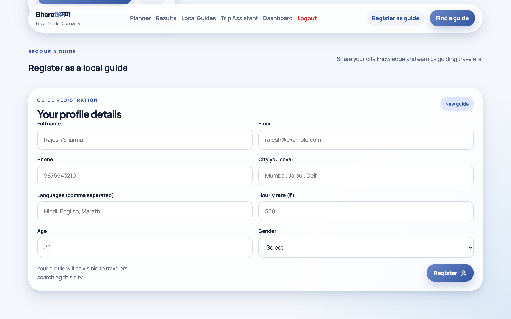
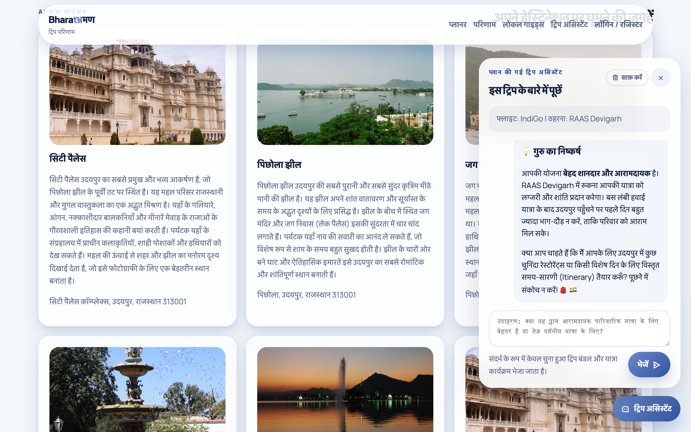
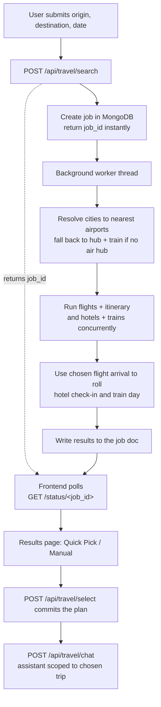

<div align="center">

# BharatBhraman

### Plan a complete India trip — flights, trains, hotels, and an AI itinerary — from one search.

Type where you are and where you want to go. BharatBhraman finds the real routes,
picks the best combination, builds a day-worthy itinerary, and lets you ask a
trip-aware assistant anything about the plan you chose.

[](https://bharatbhraman.chiragrai.de)
[](https://github.com/cro2003/HackFest_BharatBhraman/actions/workflows/ci.yml)


<br>


<sub>Oslo → Udaipur: an international trip — live flights, hotel, and AI itinerary, planned in one search.</sub>

</div>

---

## What it does

Most travel sites make you juggle four tabs — one for flights, one for trains, one
for hotels, and a blog for "what to actually do there." BharatBhraman does the
juggling for you and hands back one plan.

|  |  |
|---|---|
| **1. Tell it your trip** | Where from, where to, when. That's it. |
| **2. It searches everything at once** | Flights, trains, and hotels are looked up live and synchronized so the timings actually line up. |
| **3. You get one recommended plan** | A ready-to-go bundle — or switch to Manual Mode and compare every option yourself. |
| **4. Ask the assistant** | A chat that knows *your* chosen trip answers questions about timing, stays, and what to see. |

<div align="center">



</div>

## Why it's built this way

Booking transport is the easy 20%. The hard part — and where trips actually go
wrong — is the **seams between providers**: a flight that lands at 11 PM but the
only train onward left at 9 PM, or a "destination" that has no airport at all.

BharatBhraman is designed around those seams:

- **It plans across providers, not just in parallel.** The chosen flight's real
  arrival time rolls the hotel check-in and the onward train search to the correct
  day — a late landing automatically triggers a next-day train lookup.
- **It handles places without an airport.** Going somewhere with no air hub
  (a hill station, a deep-interior town)? It routes you *fly to the nearest hub,
  then train the rest*, and validates that the transfer is actually catchable.
- **Start from anywhere, including abroad.** International origins are supported —
  the Oslo → Udaipur trip above resolves real multi-segment flights and prices the
  whole plan in the traveller's home currency (NOK).
- **The AI answers about your trip only.** The assistant is fed just the bundle
  you selected — chosen flight, stay, and itinerary — so its advice is grounded,
  not a generic city guide.

## Feature tour

<table>
<tr>
<td width="50%" valign="top">

**Quick Pick — one best plan**

A single recommended flight + stay + itinerary bundle, laid out as a journey
timeline from start to finish. For travellers who want the system to decide.

</td>
<td width="50%" valign="top">

**Manual Mode — full control**

Prefer to choose? Compare every flight, train, and hotel option side by side and
assemble the trip yourself.

</td>
</tr>
</table>

<div align="center">



</div>

**AI itinerary — real places, not filler**

Every plan comes with a destination itinerary: actual sights with photos,
descriptions, and map links — so you land knowing what to do.

<div align="center">



</div>

<table>
<tr>
<td width="50%" valign="top">

**Trip-aware assistant**

A floating chat on the results page that already knows your selected route, stay,
and itinerary — ask about pacing, timing, or what to see.



</td>
<td width="50%" valign="top">

**Accounts & saved trips**

Sign in to save a plan, revisit it later with its chat history intact, or delete
it — all from a personal dashboard.



</td>
</tr>
<tr>
<td width="50%" valign="top">

**Find a local guide**

Discover verified local guides for your destination, filtered by city and language,
with ratings and hourly rates in ₹.



</td>
<td width="50%" valign="top">

**Become a guide**

The marketplace is two-sided — locals register a profile with their city,
languages, and rate to start earning from travellers.



</td>
</tr>
</table>

**Multilingual — translated at runtime**

Pick a language and the whole experience follows — navigation, results, the
itinerary, and even the trip assistant's replies. Here's the entire results page,
destinations, and a live chat answer, all in Hindi.

<div align="center">



</div>

---

## How it works

The core is an **asynchronous, cross-provider search**. A search doesn't block the
request — it returns a job id immediately, runs on a background worker, and the
page polls for the result.



<details>
<summary><b>Architecture deep-dive</b> (for the technically curious)</summary>

<br>

**App-factory + blueprints.** `create_app()` in `app/__init__.py` wires
MongoDB-backed sessions, request telemetry middleware, and blueprints mounted under
clean prefixes:

| Blueprint | Prefix | Responsibility |
|---|---|---|
| `core_bp` | `/` | Static HTML page shells |
| `travel_bp` | `/api/travel` | Search, status polling, selection, chat, lookups |
| `guides_bp` | `/api/guides` | Guide discovery, registration, booking |
| `auth_bp` | `/api/auth` | Register / login / logout / session identity |
| `user_bp` | `/api/user` | Dashboard, saved trips, trip chat history |
| `i18n_bp` | `/api/i18n` | Runtime UI translation |
| `telemetry_bp` | `/api/portfolio` | Request metrics for a portfolio view |

**Thin routes, fat services.** Routes only validate input and delegate; all
business logic and every third-party call lives in `app/services/`. The heart is
`travel_orchestrator.py`.

**The orchestrator does real synchronization.** `POST /api/travel/search` writes a
job to the `trip_jobs` collection and spawns a daemon thread. That worker resolves
locations → airports, then uses a `ThreadPoolExecutor` to run flights + itinerary
and hotels + trains concurrently, reads the chosen flight's absolute arrival to
schedule the hotel and onward train on the right day, and persists everything back
to the job doc. Because it runs off the request context, all state is passed
explicitly and stored in Mongo — never in `flask.session`.

**Framework-free frontend.** No React, no build step. `static/scripts/app.js`
reads `document.body.dataset.page` and dispatches to a page module; shared logic
lives in ES modules (`api.js`, `config.js`, `i18n.js`, `motion.js`, `renderers.js`,
`storage.js`). One consolidated `static/styles/index.css`.

</details>

<details>
<summary><b>API surface</b></summary>

<br>

Every response uses one JSON envelope (`app/utils/api_response.py`) — either
`{ "status": "success", "data": ... }` or
`{ "status": "error", "code": "MACHINE_CODE", "message": ... }` — so the frontend
handles success and failure uniformly.

| Area | Endpoint | Purpose |
|---|---|---|
| Lookup | `GET /api/travel/lookup/location?q=` | City / place autocomplete |
| Lookup | `GET /api/travel/lookup/airport?q=` | Airport lookup |
| Lookup | `GET /api/travel/lookup/train-station?q=` | Railway station lookup |
| Search | `POST /api/travel/search` | Start async trip search → `job_id` |
| Status | `GET /api/travel/status/<job_id>` | Poll search job |
| Select | `POST /api/travel/select` | Commit a Quick Pick or manual plan |
| Chat | `POST /api/travel/chat` | Trip-aware assistant |
| Guides | `GET /api/guides/search?city=&lang=` | Discover local guides |
| Guides | `POST /api/guides/register` · `/book` · `/review` | Guide lifecycle |
| Auth | `POST /api/auth/register` · `/login` · `/logout` | Session auth |
| User | `POST /api/user/save-trip` · `/open-trip` · `/delete-trip` | Saved trips |
| i18n | `POST /api/i18n/translate` | Runtime UI translation |

</details>

<details>
<summary><b>Engineering decisions & trade-offs</b></summary>

<br>

- **Async job model over a long request.** Cross-provider travel search takes tens
  of seconds against flaky third parties. A blocking request would time out behind
  most proxies, so search is a background job + polling. A stale-job guard marks any
  `processing` job older than 5 minutes as failed, since a worker thread can be
  reaped on a serverless / gunicorn restart.
- **Session-only auth.** An earlier JWT path was issued but never verified — dead
  code and a false sense of security — so it was removed entirely in favour of
  MongoDB-backed server sessions (bcrypt password hashing, HTTP-only `SameSite=Lax`
  cookies, HTTPS-only in production). `SECRET_KEY` is mandatory: the app refuses to
  start on an insecure default.
- **Least-exposure data handling.** Guide search projects out `email`/`phone` —
  contact details are only returned after a confirmed booking. Trip and booking
  queries are always scoped by `{ _id, user_id }` so one user can't read another's
  data. Client-facing errors carry a machine code and a generic message; full stack
  traces stay in the logs.
- **Config is entirely environment-driven.** No hardcoded secrets, hosts, ports, or
  database names — everything reads from the environment (`.env.example` documents
  the full surface), and required keys fail fast if missing.
- **Vanilla JS on purpose.** The frontend has zero framework and zero build step —
  it demonstrates DOM, fetch, ES-module, and state-management fundamentals directly,
  and deploys as plain static files.
- **Tested where it matters.** 118 offline, deterministic unit tests cover parsing,
  validation, routing regressions, and service logic; a separate opt-in suite runs
  live end-to-end against real providers and the database.

**Known trade-offs (documented, not hidden):** the legacy IRCTC / RailYatri
providers reject modern TLS, so requests to *those hosts only* use a relaxed SSL
adapter — scoped deliberately, not globally. Multi-hop train routing and rate
limiting on auth / AI endpoints are noted as next steps below.

</details>

---

## Run it locally

**Prerequisites:** Python 3.12+, a MongoDB connection string, and API keys for
Google Gemini and Geoapify.

```bash
# 1. Clone
git clone <repo-url> && cd HackFest_BharatBhraman

# 2. Virtual environment
python3 -m venv venv && source venv/bin/activate

# 3. Dependencies
pip install -r requirements.txt

# 4. Configure — copy the template and fill in real values
cp .env.example .env
#   required: MONGO_DB_URL, SECRET_KEY, GEMINI_API_KEY, LOCATION (Geoapify)

# 5. Run
python run.py            # dev server → http://127.0.0.1:5000
```

**Tests**

```bash
python -m pytest -m "not integration and not network"    # fast offline suite (118 tests)
RUN_INTEGRATION=1 python -m pytest tests/test_integration_live.py   # live (real APIs + DB)
```

See [`.env.example`](.env.example) for every supported variable and its default.

## Tech stack

| Layer | Choice |
|---|---|
| **Backend** | Python 3.12, Flask (app-factory + blueprints), Flask-Session |
| **Frontend** | Vanilla JavaScript (ES modules), HTML, one CSS file — no framework |
| **Database** | MongoDB (sessions, jobs, users, trips, guides, telemetry) |
| **AI** | Google Gemini via LangChain |
| **Providers** | Geoapify (geocoding) · IRCTC Air (flights) · RailYatri / ConfirmTkt (trains) · IRCTC + Geoapify (hotels) |
| **Auth** | Server sessions + bcrypt |
| **Serving** | Gunicorn-compatible WSGI |

## Deployment

The app runs under any WSGI server:

```bash
gunicorn run:app
```

For production, set the environment variables from `.env.example` (required:
`MONGO_DB_URL`, `SECRET_KEY`, `GEMINI_API_KEY`, `LOCATION`), set
`SESSION_COOKIE_SECURE=true` behind HTTPS, and point `MONGO_DB_URL` at your
cluster. Config is fully env-driven — no code changes needed to deploy.

## Roadmap

- Multi-hop train routing for the deepest-interior destinations
- Rate limiting on auth and AI endpoints (Flask-Limiter)
- Live seat / fare refresh on the results page
- Expanded guide marketplace (payments, verified reviews)

---

<div align="center">

**Built as a full-stack showcase** — product design, API orchestration, async job
handling, third-party integration, and AI-assisted UX, end to end.

The most interesting code lives in
[`app/services/travel_orchestrator.py`](app/services/travel_orchestrator.py): it
takes several unreliable providers and turns them into one coherent plan.

Licensed under the [MIT License](LICENSE).

</div>
